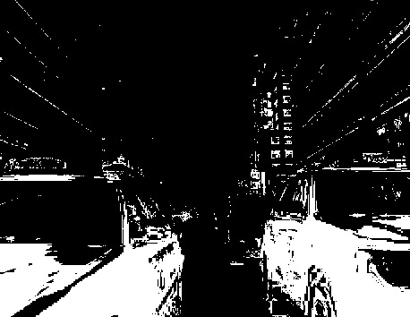
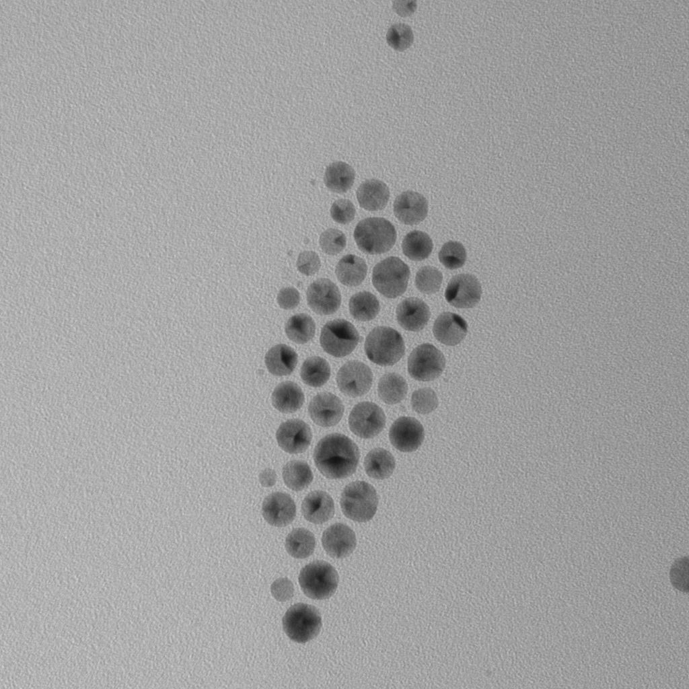
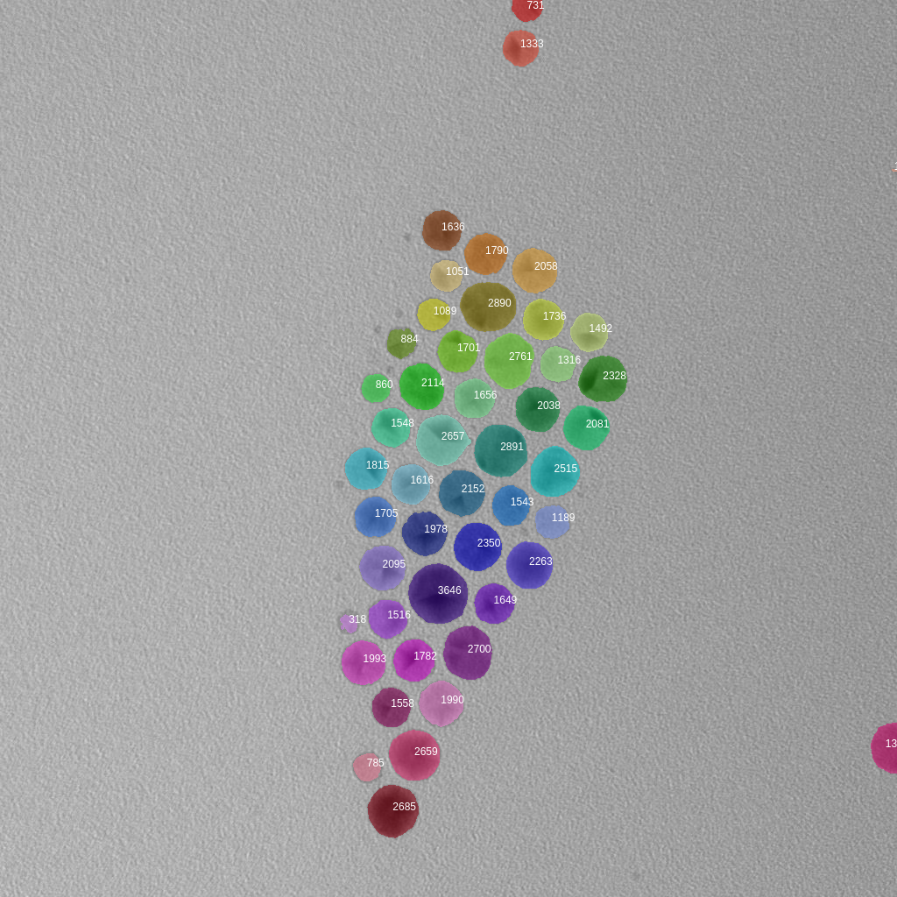

# image-js

[![NPM version][npm-image]][npm-url]
[![build status][travis-image]][travis-url]
[![Test coverage][codecov-image]][codecov-url]
[![npm download][download-image]][download-url]

Advanced image processing and manipulation in JavaScript.

image-js is a full-featured library that can deal with simple image processing
(color leveling, grey image, mask, resize, rotation, etc.) as well as advanced
processing on scientific images (Region of interest (ROI), Hull curve, minimal
boundary rectangle (MBR), particle size and orientation, cell imaging, etc.).

## [API Documentation](https://image-js.github.io/image-js/)

## Installation

`$ npm install image-js`

## Features

### Supported image formats

The following formats can be loaded by image-js:

- PNG (8 or 16 bits, color or greyscale, with or without alpha, palette 1 - 8 bits)
- JPEG
- TIFF (8 or 16 bits, greyscale)

The following formats can be saved by image-js:

- PNG (8 or 16 bits)
- JPEG
- BMP (black and white)

### Native support for various bit depths and image kinds

image-js was developed to be used in scientific applications where we often
have to work on images that have more that 8 bits per channel.  
Unlike many other libraries, if a 16-bit greyscale PNG is decoded, the resulting
image has only one 16-bit channel and no pixel information is lost.

image-js can work with images that have 1 (binary), 8, 16 or 32 bits per channel.  
It can accept an arbitrary amount of color channels (usually 1 or 3) and can
handle an additional alpha component.

### Basic image manipulation

image-js can be used to do simple image manipulations such as:

- Resize
- Crop
- Rotate
- Convert to greyscale
- Invert colors
- Gaussian blur
- Extract individual channels (red, green or blue)
- And more...

### Statistics

image-js implements a number of functions to get statistics about an image:

- Histogram
- Max, min, median value
- And more ...

### Advanced features for computer vision

- Image thresholding (otsu, triangle, ...)
- Regions of interest
- Convolution with custom kernel
- Sobel filter
- Morphological transformations (open, close, erode, ...)

## An example using npm and node

Install the library:

```console
npm i image-js
```

An example of code manipulating the image 'cat.jpg' (you need to create it).

```js
const { Image } = require('image-js');

execute().catch(console.error);

async function execute() {
  let image = await Image.load('cat.jpg');
  let grey = image
    .grey() // convert the image to greyscale.
    .resize({ width: 200 }) // resize the image, forcing a width of 200 pixels. The height is computed automatically to preserve the aspect ratio.
    .rotate(30); // rotate the image clockwise by 30 degrees.
  return grey.save('cat.png');
}
```

```console
node index.js
```

A greyscale image will be saved in the same folder.

## Examples in the browser

### Load an image and convert it to grey

```html
<html>

<head>
    <script src="https://www.lactame.com/lib/image-js/0.21.2/image.min.js"></script>
</head>

<body>
    
    

    <script>
        async function process() {
            let image = await IJS.Image.load(document.getElementById('color').src);

            let grey=image.grey();

            document.getElementById('result').src = grey.toDataURL();
        }
        process();
    </script>

</body>

</html>
```


[Try it](https://www.w3schools.com/code/tryit.asp?filename=FVD6UC9S7RSV)

### Create a mask



[Try it](https://www.w3schools.com/code/tryit.asp?filename=FVD6TP7ICRZM)

### Paint a mask


[Try it](https://www.w3schools.com/code/tryit.asp?filename=FVD6T1Y63MUH)

### Filter a mask using Region Of Interests (ROIs)

Image-js has a powerful Region of Interests Manager that allows to create ROIs from different sources. The ROIs can then be filtered, manipulated and finally painted to an RGBA image.


[Try it](https://www.w3schools.com/code/tryit.asp?filename=FVD6SE2F4MWE)

When extracting a mask from a ROI you have many options (`contour`, `box`, `filled`, `center`, `hull` or `normal`). Here it looks better to use the `filled` ROI.


[Try it](https://www.w3schools.com/code/tryit.asp?filename=FVD6QQISMLZ2)

### Advanced analysis of SEM / TEM images

This library is able to deal with complex analysis involving images of cell or SEM / TEM. It will deal correctly with 16 bits grey scale images (TIFF or PNG) commonly found in scientific results.

In this example we will annotate an SEM / TEM image by coloring each particle and show the surface of them.




We also display a table containing a summary of all the identified particles.

[Try it](https://www.w3schools.com/code/tryit.asp?filename=FVCJLR0VNK33)

## Development

Contributions to code or documentation are welcome! Here are a few tips on how to
setup a development environment for image-js.

### Canvas

The `canvas` native addon library is required for all tests to pass. You can
follow the instructions to install it on your OS [here](https://github.com/Automattic/node-canvas#installation).

## License

[MIT](./LICENSE)

[npm-image]: https://img.shields.io/npm/v/image-js.svg?style=flat-square
[npm-url]: https://www.npmjs.com/package/image-js
[travis-image]: https://img.shields.io/travis/image-js/image-js/master.svg?style=flat-square
[travis-url]: https://travis-ci.org/image-js/image-js
[codecov-image]: https://img.shields.io/codecov/c/github/image-js/image-js.svg?style=flat-square
[codecov-url]: https://codecov.io/gh/image-js/image-js
[download-image]: https://img.shields.io/npm/dm/image-js.svg?style=flat-square
[download-url]: https://www.npmjs.com/package/image-js
